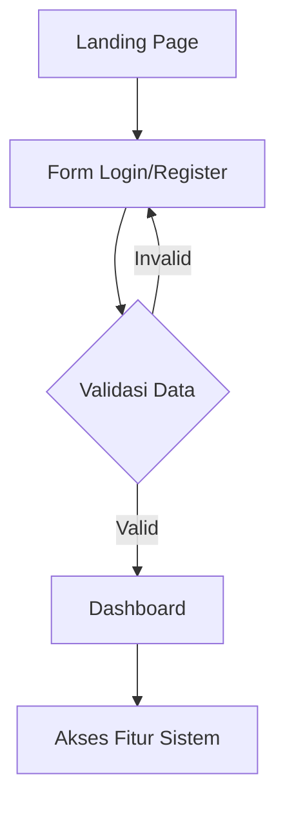
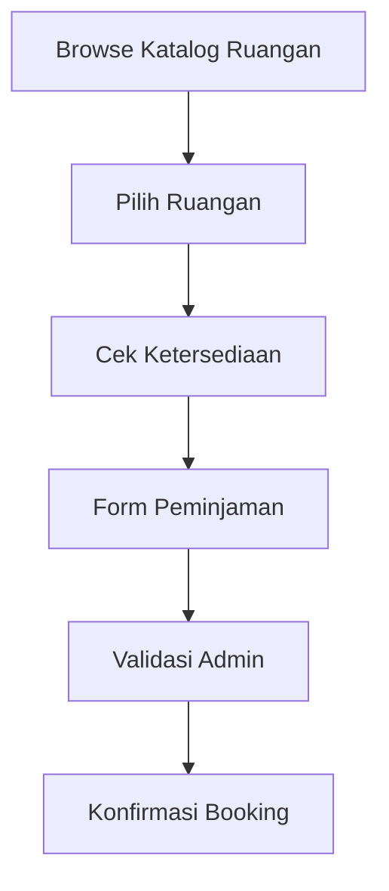
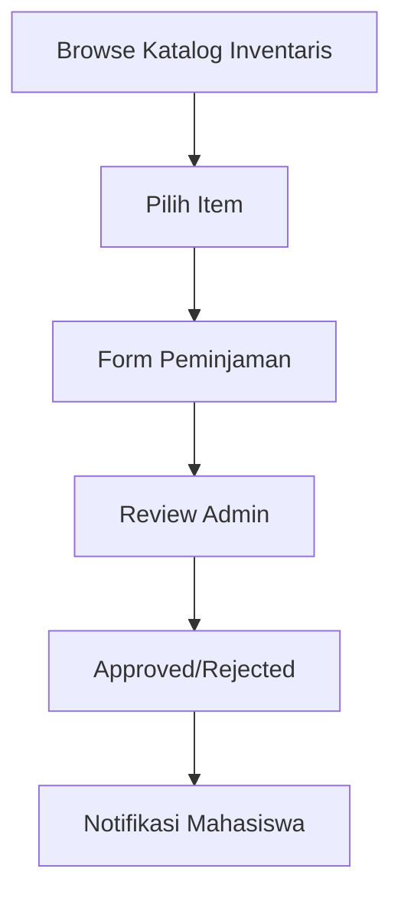
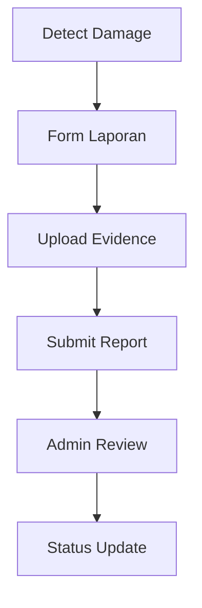

# RUANGFRI - Sistem Peminjaman Fasilitas FRI

<p align="center">
  
  
  
  
</p>

## Tentang RUANGFRI

RUANGFRI adalah platform digital terpadu untuk sistem peminjaman ruangan dan inventaris di Fakultas Rekayasa Industri (FRI), Telkom University. Sistem ini memungkinkan mahasiswa untuk mengakses dan meminjam fasilitas kampus dengan mudah melalui antarmuka web yang modern dan responsif.

## Fitur Utama

### 🏢 Manajemen Ruangan
- **Katalog Ruangan**: Tampilan komprehensif semua ruangan yang tersedia
- **Sistem Booking**: Peminjaman ruangan dengan validasi jadwal
- **Filter & Pencarian**: Pencarian ruangan berdasarkan kriteria spesifik
- **Status Real-time**: Informasi ketersediaan ruangan secara langsung

### 📦 Manajemen Inventaris
- **Katalog Inventaris**: Database lengkap semua inventaris yang dapat dipinjam
- **Sistem Peminjaman**: Proses peminjaman inventaris dengan tracking
- **Laporan Kerusakan**: Sistem pelaporan untuk inventaris yang rusak
- **Manajemen Status**: Tracking status inventaris (tersedia/dipinjam/rusak)

### 👤 Sistem Autentikasi
- **Multi-Guard Authentication**: Sistem login terpisah untuk mahasiswa dan admin
- **Registrasi Mahasiswa**: Pendaftaran akun dengan validasi NIM dan email
- **Dashboard Personal**: Interface khusus untuk setiap tipe pengguna
- **Session Management**: Pengelolaan sesi yang aman dan persistent

### 📊 Dashboard & Reporting
- **Dashboard Mahasiswa**: Riwayat peminjaman dan status aktif
- **Dashboard Admin**: Manajemen sistem dan monitoring
- **Laporan Komprehensif**: Generate laporan dalam format PDF
- **Analytics**: Statistik penggunaan fasilitas

## Teknologi yang Digunakan

### Backend
- **Framework**: Laravel 12.0
- **PHP Version**: 8.2+
- **Database**: MySQL 8.0+
- **Authentication**: Laravel Multi-Guard
- **PDF Generation**: DomPDF
- **Cache**: Database/File Cache

### Frontend
- **CSS Framework**: Bootstrap 5
- **JavaScript**: Vanilla JS dengan AJAX
- **Icons**: Font Awesome
- **Animations**: AOS (Animate On Scroll)
- **Build Tool**: Vite

### Testing
- **Unit Testing**: PHPUnit 11.5+
- **Browser Testing**: Laravel Dusk
- **Database**: Dedicated testing database

## Arsitektur Sistem

### Database Schema
```
├── admin_logistik (Admin users)
├── mahasiswa (Student users)
├── ruangan (Rooms)
├── inventaris (Inventory items)
├── pinjam_ruangan (Room bookings)
├── pinjam_inventaris (Inventory loans)
├── lapor_inventaris (Damage reports)
└── jadwals (Schedules)
```

### Struktur MVC
```
app/
├── Http/Controllers/
│   ├── MahasiswaAuthController.php
│   ├── RuanganController.php
│   ├── InventarisController.php
│   └── ...
├── Models/
│   ├── Mahasiswa.php
│   ├── Ruangan.php
│   ├── Inventaris.php
│   └── ...
└── Providers/
```

### Guards & Authentication
- **mahasiswa**: Guard untuk autentikasi mahasiswa
- **admin**: Guard untuk autentikasi admin logistik
- **Middleware**: Proteksi route berdasarkan role

## Alur Sistem

### 1. Registrasi & Login


### 2. Peminjaman Ruangan


### 3. Peminjaman Inventaris


### 4. Pelaporan Kerusakan


## Quick Start

### Prerequisites
- PHP 8.2+
- Composer
- MySQL 8.0+
- Node.js 16+

### Installation
```bash
# Clone repository
git clone https://github.com/your-repo/RUANGFRI_TIM_367_SI4603.git
cd RUANGFRI_TIM_367_SI4603

# Install dependencies
composer install
npm install

# Environment setup
cp .env.example .env
php artisan key:generate

# Database setup
php artisan migrate
php artisan db:seed

# Build assets
npm run build

# Start development server
php artisan serve
```

### Testing
```bash
# Run unit tests
php artisan test

# Run browser tests
php artisan dusk

# Run specific test
php artisan test --filter=LoginTest
```

## API Endpoints

### Authentication
- `POST /mahasiswa/register` - Registrasi mahasiswa
- `POST /mahasiswa/login` - Login mahasiswa
- `POST /admin/login` - Login admin

### Ruangan
- `GET /ruangan` - List semua ruangan
- `POST /ruangan/book` - Booking ruangan
- `GET /ruangan/{id}` - Detail ruangan

### Inventaris
- `GET /inventaris` - List inventaris
- `POST /inventaris/pinjam` - Pinjam inventaris
- `POST /inventaris/lapor` - Lapor kerusakan

## Konfigurasi

### Environment Variables
```bash
# Database
DB_CONNECTION=mysql
DB_HOST=127.0.0.1
DB_PORT=3306
DB_DATABASE=ruangfri_db
DB_USERNAME=root
DB_PASSWORD=

# Session
SESSION_DRIVER=database
SESSION_LIFETIME=120

# Cache
CACHE_STORE=database
```

### Multi-Database Support
- **Production**: `ruangfri_db`
- **Testing**: `ruangfri_testing`
- **Dusk Testing**: Dedicated test environment

## Security Features

- **CSRF Protection**: Token validation untuk semua form
- **Input Validation**: Comprehensive validation rules
- **Password Hashing**: Bcrypt dengan rounds konfigurasi
- **Session Security**: Regeneration dan timeout
- **SQL Injection Prevention**: Eloquent ORM dan prepared statements

## Performance Optimization

- **Database Indexing**: Optimized queries
- **Caching**: Strategic caching implementation
- **Asset Optimization**: Vite build process
- **Lazy Loading**: Efficient data loading

## Kontribusi

1. Fork repository
2. Buat feature branch (`git checkout -b feature/AmazingFeature`)
3. Commit changes (`git commit -m 'Add AmazingFeature'`)
4. Push ke branch (`git push origin feature/AmazingFeature`)
5. Buat Pull Request

## Tim Pengembang

**TIM 367 - SI4603**
- Project Lead: [Name]
- Backend Developer: [Name]
- Frontend Developer: [Name]
- UI/UX Designer: [Name]

## License

Project ini menggunakan [MIT License](LICENSE).

## Support

Untuk pertanyaan atau dukungan teknis, silakan hubungi:
- Email: support@ruangfri.edu
- GitHub Issues: [Create Issue](https://github.com/your-repo/issues)

---

<p align="center">
Made with ❤️ by TIM 367 - Fakultas Rekayasa Industri, Telkom University
</p>